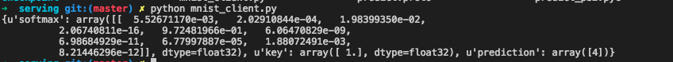
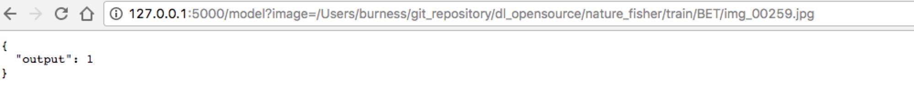
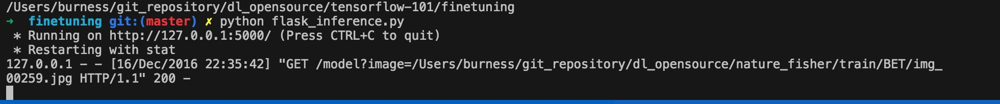
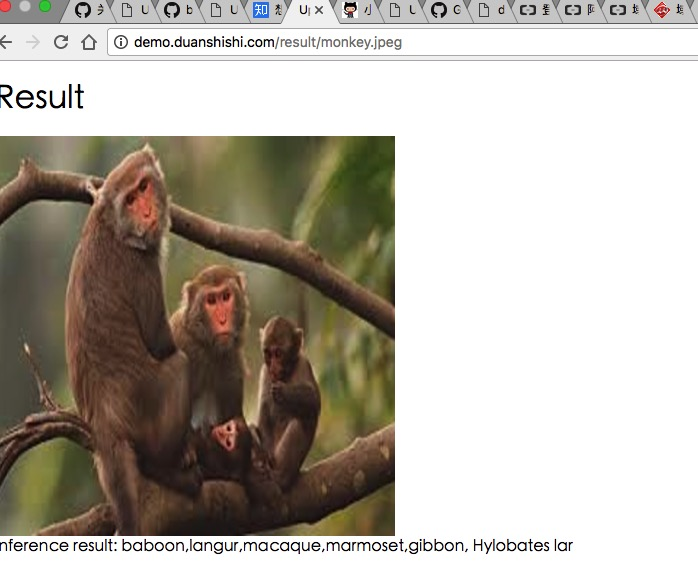
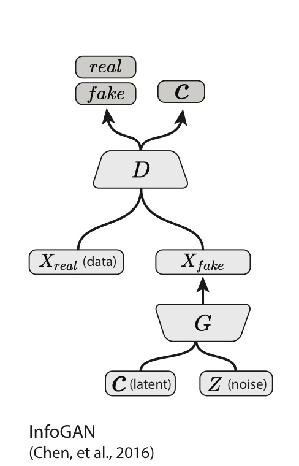
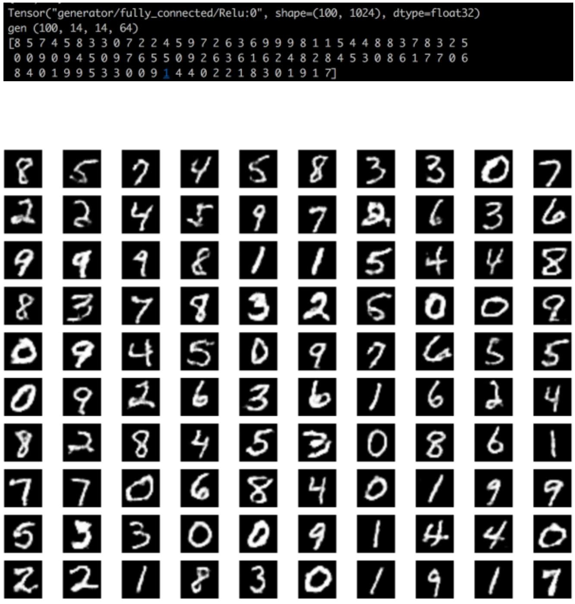
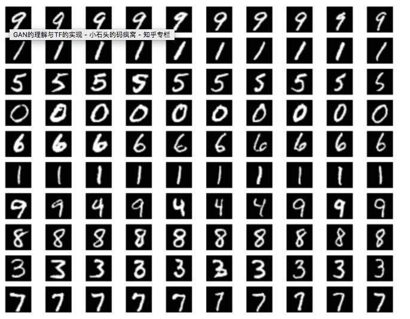
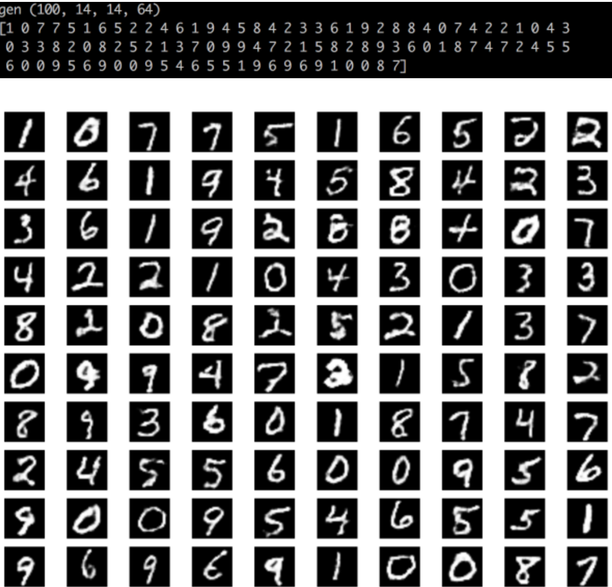
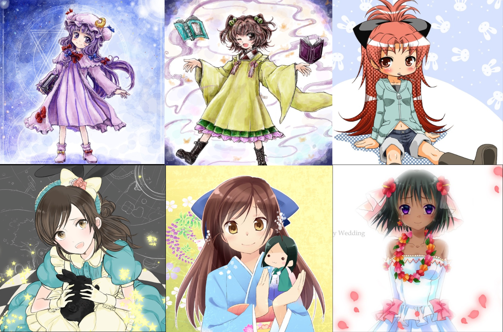
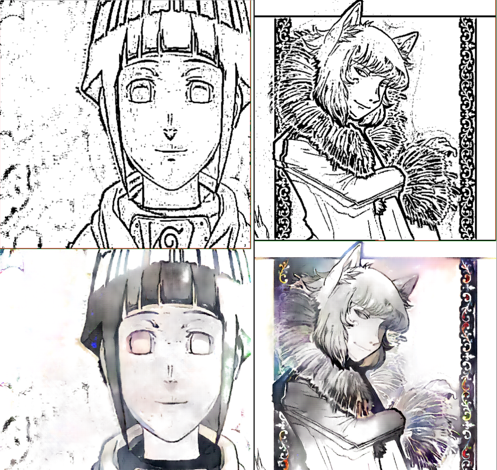

## algorithm

MLP for mnist done

## covert to tfrecord

test on 102flowers done
command like this:

`python covert_somedata_to_tfrecord.py --dataset_name=102flowers --dataset_dir='./'`

## serving
test on MLP model on mnist done

download the mnist jpgs on baidu yunpan [mnist jpgs](https://pan.baidu.com/s/1o8EWkVS)

Reference: [https://github.com/tobegit3hub/deep_recommend_system](https://github.com/tobegit3hub/deep_recommend_system)

## finetuning and deploy model with flask

In folder finetuning, we use tf.slim to finetuning the pretrain model (I use the same method in my porn detection) and use flask to buid a very simple inference system.

## Inference Demo

I deploy a image classification in [demo page](http://demo.duanshishi.com). It is based on Tensorflow and Flask. Feel free to try.

## Chinese rec

You can get the detailed introductation in [TensorFlow与中文手写汉字识别](http://hacker.duanshishi.com/?p=1753)

## GAN
### AC-GAN and Info-GAN in TensorFlow
The project in GAN includ AC-GAN and Info-GAN:

 - AC-GAN 
 - Info-GAN 

### Result
Infogan result:

AC-GAN result:

You can get detailed information in [GAN的理解与TF的实现](http://hacker.duanshishi.com/?p=1766)

## DeepColor

The images from [safebooru.org](http://safebooru.org), you can download from the baidu yunpan [https://pan.baidu.com/s/1c1HOIHU](https://pan.baidu.com/s/1c1HOIHU).

The results:

details in [CGAN之deepcolor实践](http://www.duanshishi.com/?p=1791)

## Text Classifer

You can get the detail information in [自然语言处理第一番之文本分类器](http://hacker.duanshishi.com/?p=1805).
Classic methods such as Word Count Distribution and TF-IDF and DeepLearning Methods based CNN and C-LSTM are provided in [nlp/text_classifier](https://github.com/burness/tensorflow-101/tree/master/nlp/text_classifier)