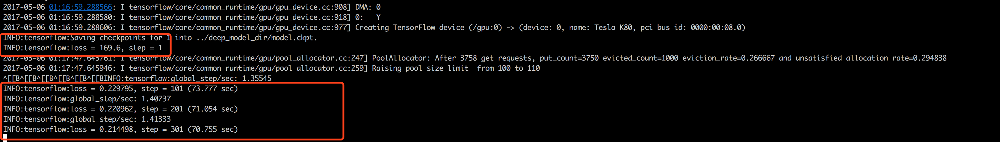

## The examples of tf.learn

### LinearClassifier
### RandomForest
### SVM

### Add monitor in wide and deep model
[https://www.tensorflow.org/get_started/monitors](https://www.tensorflow.org/get_started/monitors)

 1. add `tf.logging.set_verbosity(tf.logging.INFO)`, then you can log the loss:
    
 2. validation_monitor: a bug with input_fn, eval_steps=None gen the bug, set eval_steps =1 would solve it.
    
 3. how to set validation_metrics, see the code [tensorflow/contrib/learn/python/learn/metric_spec.py](https://github.com/tensorflow/tensorflow/blob/r1.1/tensorflow/contrib/learn/python/learn/metric_spec.py) here. Specify the prediction_key and labal_key (None maybe the default )